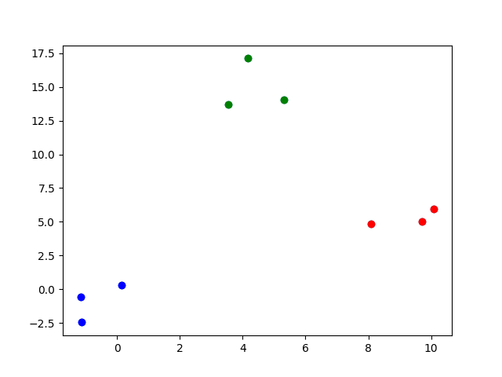
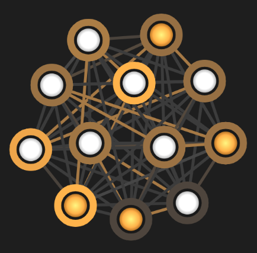

[](
  https://circleci.com/gh/dwave-examples/clustering)

# Clustering

A demo on identifying clusters in a data set using the D-Wave quantum computer.

When dealing with large data sets, we do not always have neatly labeled data
(i.e. most, if not all, the data could be unlabeled). However, all is not lost
as we can still extract insights from this data through clustering.

For example, when dealing with housing data---namely, square footage and
price---we can identify clusters in that data which may be indicative of
different neighborhoods. Another example could be having a boolean vector of TV
shows that consumers watch; clusters in this data could help identify a
particular consumer demographic.

As well, if we do have a few labelled data points in our data set, we could
potentially label the entire cluster based on these.



Figure: A data set of nine points that have been divided into three clusters
(shown with different colors).

## Usage

To run the demo with a simple, hardcoded data set:

```bash
python clustering.py
```

To run the same demo with a slightly more sophisticated data set:

```bash
python example_clusters.py
```

This provides a visualization of the problem on the D-Wave problem inspector,
and plots of the original data set and its solution.

## Code Overview

The D-Wave quantum computer accepts problems formulated mathematically in Binary
Quadratic Model (BQM) format. The goal here is to build a BQM such that it
represents our clustering problem. Namely, we want a BQM such that a low-energy
solution found by the D-Wave quantum computer would correspond to a solution
to our clustering problem.

Key properties of the clustering problem that we need to capture in our BQM:

* Each data point can only be a part of one cluster
* Data points that are close together should be a part of the same cluster
* Data points that are far apart should be in different clusters

## Code Specifics

Let's go through how we implement each of the key properties of our clustering
problem.

### Each data point can only join one cluster

* The code is only considering three different cluster labels: red, green, and
  blue.
* Since a qubit can only end up in one of two states (i.e. it can only
  answer yes or no questions), each data point has three nodes associated to it:
  `<coordinate>.r`, `<coordinate>.g`, and `<coordinate>.b`. That way, we
  can answer yes-no questions for whether a specific coordinate is in a
  particular colour cluster.
* The rule that a data point may only join one cluster is represented by the
  variable `choose_one_group` (shown below). Each three-item-tuple below can
  be interpreted as `(<join-red>, <join-green>, <join-blue>)`, where the
  1s and 0s indicate true and false, respectively. Hence, the
  `choose_one_group` is a set of all valid states. (e.g. `(1, 1, 0)` is not
  valid because a data point is not allowed to be in both red and green clusters
  at once).

  ```bash
  choose_one_group = {(0, 0, 1), (0, 1, 0), (1, 0, 0)}
  ```

* You can easily see this "choose one group" constraint in the D-Wave inspector.
  The image below has four data points (as seen in `clustering.py`). Each of
  the four data points has three nodes associated with it - `<coordinate>.r`,
  `<coordinate.g>`, and `<coordinate.b>` - hence the twelve nodes below.
* A particular data point's set of three nodes can actually be identified in the
  graph below.  By noting the yellow triangles below, we can see that one vertex
  is selected (in yellow) and two vertices are not selected (in white).



* In the actual D-Wave Inspector, you can hover over these nodes and find out
  which data point and colour they represent and the BQM weights that are placed
  on them.

### Close data points should be in the same cluster

* If we set BQM weights such that clustering close data points has lower-energy
  solutions, when the quantum computer minimizes the BQM, it finds good
  solutions to the clustering problem.
* These weights are dependent on distance. In order to keep the weights within
  a reasonable range, the distances are all scaled with respect to the
  `max_distance`, the largest distance between any two points in the data set.
* Below is the function used to determine the weight to encourage close together
  points to be in the same cluster

  ```bash
  d = get_distance(coord0, coord1) / max_distance  # rescale distance
  weight = -math.cos(d*math.pi)
  ```

* We can apply many different types of functions for generating the weight.
  In this case, we chose a cosine function. The main idea is that we simply
  need short distances (nearby points) to generate a strong negative value that
  contributes to clustering these points, while points with large distances are
  only mildly affected.

### Far-apart data points should be in different clusters

* Here, we want to encourage far apart data points to be in different clusters.
  Again, since the D-Wave quantum computer seeks low-energy configurations, we
  need to make far apart data points correspond to lower energy.
* We do this by choosing a strong negative weight for far apart points. Hence,
  the choice of the `tanh` function.

  ```bash
  d = math.sqrt(get_distance(coord0, coord1) / max_distance)
  weight = -math.tanh(d) * 0.1
  ```

* Note that a scalar of `0.1` was applied in order to prevent this weight from
  overwhelming the other weights in the BQM. The `0.1` is arbitrary and was
  found by tinkering with the code.

## License

Released under the Apache License 2.0. See [LICENSE](LICENSE) file.
